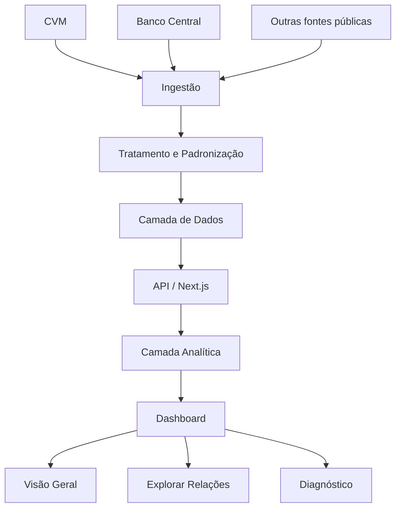
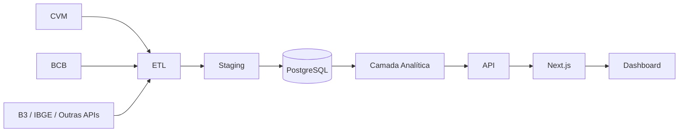

# BI.ECONÔMICO

> Plataforma experimental de Business Intelligence e Ciência de Dados para análise integrada de empresas brasileiras e indicadores econômicos.

[](https://nextjs.org/)
[](https://www.typescriptlang.org/)
[](https://vercel.com/)
[]()

**Aplicação:** [bi-economico.vercel.app](https://bi-economico.vercel.app)  
**Repositório:** [github.com/Josue20000904/bi-economico](https://github.com/Josue20000904/bi-economico)

---

## Sobre o projeto

O **BI.ECONÔMICO** é um projeto de portfólio desenvolvido para integrar conceitos de:

- Business Intelligence;
- Engenharia e tratamento de dados;
- Análise financeira;
- Economia;
- Estatística;
- Data Visualization;
- Desenvolvimento web;
- Ciência de Dados.

A proposta é permitir que dados empresariais e indicadores macroeconômicos sejam analisados em uma única interface.

Em vez de apresentar apenas demonstrações financeiras ou indicadores econômicos isoladamente, o projeto busca responder perguntas como:

- Como a receita de uma empresa evoluiu ao longo do tempo?
- Como lucro e margens se comportaram em diferentes períodos?
- Existe associação entre uma variável econômica e uma métrica empresarial?
- Essa relação ocorre no mesmo período ou apresenta defasagem?
- Qual é a intensidade dessa associação?
- Existem mudanças relevantes de tendência?
- Há pontos atípicos na série histórica?
- Como empresas de um mesmo segmento podem ser comparadas?

O projeto está sendo desenvolvido de forma incremental, começando por um MVP e evoluindo para uma arquitetura com maior cobertura de empresas, indicadores, persistência e capacidade analítica.

---

# Objetivo

Construir uma plataforma analítica capaz de:

1. coletar dados econômicos e empresariais;
2. padronizar diferentes fontes públicas;
3. estruturar séries históricas;
4. transformar os dados em indicadores analíticos;
5. aplicar métodos estatísticos exploratórios;
6. disponibilizar as informações em uma interface web interativa;
7. permitir expansão para diferentes empresas e segmentos da economia brasileira.

---

# Status atual

O projeto encontra-se na fase de **MVP funcional**.

Atualmente estão implementados:

- dashboard web responsivo;
- filtros analíticos;
- séries históricas empresariais;
- integração com dados da CVM;
- integração com indicadores do Banco Central;
- correlação de Pearson;
- análise de defasagem temporal;
- regressão linear;
- coeficiente R²;
- detecção exploratória de anomalias;
- indicadores de tendência e volatilidade;
- identificação entre dados reais e demonstrativos;
- deploy automatizado pela Vercel.

A arquitetura foi construída para permitir expansão gradual da quantidade de empresas, indicadores e fontes de dados.

---

# Funcionalidades

## Visão Geral

A área de visão geral apresenta o comportamento histórico da empresa selecionada.

Principais recursos:

- KPIs financeiros;
- comparação entre períodos;
- série histórica;
- filtros por empresa;
- filtros por segmento;
- seleção da métrica empresarial;
- definição do período analisado.

---

## Explorar Relações

O módulo de relações permite comparar uma variável empresarial com um indicador econômico.

Exemplo:

```text
SELIC
   ↓
Receita da empresa
```

ou:

```text
Câmbio
   ↓
Lucro líquido
```

A análise inclui:

- correlação de Pearson;
- direção da associação;
- intensidade da associação;
- número de observações;
- defasagens temporais;
- seleção automática do melhor lag;
- gráfico de dispersão;
- regressão linear;
- coeficiente R².

---

## Diagnóstico

O módulo de diagnóstico busca identificar características importantes das séries históricas.

Entre os indicadores analisados estão:

- tendência;
- crescimento ou queda acumulada;
- volatilidade;
- coeficiente de variação;
- alterações relevantes;
- observações atípicas;
- comportamento recente da série.

---

# Escopo atual dos dados

| Conjunto | Situação | Fonte |
|---|---|---|
| Receita líquida da Petrobras | Real | CVM |
| Lucro líquido da Petrobras | Real | CVM |
| SELIC | Real | Banco Central do Brasil |
| IPCA | Real | Banco Central do Brasil |
| Câmbio | Real | Banco Central do Brasil |
| EBITDA | Demonstrativo | Simulação |
| Margem | Demonstrativo | Simulação |
| Demais empresas | Demonstrativo | Simulação |
| Ibovespa | Demonstrativo no MVP | Simulação |
| Brent | Demonstrativo no MVP | Simulação |
| Desemprego | Demonstrativo no MVP | Simulação |

Dados simulados são explicitamente identificados na aplicação para evitar interpretação como informação oficial.

---

# Arquitetura do projeto

O BI.ECONÔMICO foi estruturado em camadas para separar aquisição, tratamento, análise e apresentação dos dados.



---

# Arquitetura de dados

A arquitetura de dados é dividida conceitualmente em seis etapas.

```text
FONTES
  ↓
INGESTÃO
  ↓
TRATAMENTO
  ↓
ARMAZENAMENTO
  ↓
CAMADA ANALÍTICA
  ↓
APRESENTAÇÃO
```

## 1. Fontes

As principais fontes consideradas pelo projeto são:

### CVM

Utilizada para obtenção de informações financeiras das companhias abertas.

Exemplos:

- receita líquida;
- lucro líquido;
- demonstrações financeiras;
- informações trimestrais.

### Banco Central do Brasil

Utilizado para indicadores macroeconômicos.

Exemplos:

- SELIC;
- IPCA;
- câmbio;
- outras séries disponibilizadas pelo SGS/BCB.

### B3

Fonte planejada para expansão do projeto.

Possíveis informações:

- empresas listadas;
- códigos de negociação;
- preços históricos;
- dados de mercado.

### Outras fontes planejadas

A arquitetura permite futura incorporação de fontes como:

- IBGE;
- IPEA;
- ANP;
- dados setoriais;
- outras APIs públicas.

---

# Pipeline de dados

O fluxo lógico planejado para o projeto é:

```text
Fonte externa
     ↓
Extração
     ↓
Validação
     ↓
Padronização
     ↓
Transformação
     ↓
Persistência
     ↓
Camada analítica
     ↓
API
     ↓
Dashboard
```

## Extração

Os dados podem ser obtidos por:

- APIs públicas;
- arquivos disponibilizados por órgãos oficiais;
- scripts de importação;
- datasets estruturados.

---

## Tratamento

As transformações incluem:

- conversão de tipos;
- tratamento de valores ausentes;
- padronização de datas;
- normalização de períodos;
- conversão de valores financeiros;
- identificação da empresa;
- padronização dos indicadores;
- criação de chaves temporais.

Exemplo conceitual:

```text
2024 + trimestre 1
        ↓
      2024T1
```

Essa padronização permite relacionar dados financeiros e econômicos utilizando a mesma referência temporal.

---

# Arquitetura atual do MVP

No estágio atual, parte dos dados é armazenada diretamente em estruturas utilizadas pela aplicação.

```text
CVM
 ↓
Scripts de importação
 ↓
Dados estruturados
 ↓
src/data
 ↓
Hooks
 ↓
Camada analítica
 ↓
Componentes React
 ↓
Dashboard
```

Para indicadores econômicos:

```text
Banco Central
 ↓
API
 ↓
/api/economic-data
 ↓
Hooks
 ↓
Tratamento
 ↓
Dashboard
```

---

# Arquitetura-alvo

Conforme a quantidade de empresas e séries crescer, a arquitetura poderá evoluir para:



Essa evolução permitirá:

- centralizar dados históricos;
- reduzir dependência de arquivos locais;
- armazenar múltiplas empresas;
- aumentar a quantidade de séries;
- automatizar atualizações;
- melhorar consultas analíticas;
- criar comparações entre empresas;
- construir novas análises estatísticas.

> PostgreSQL representa a arquitetura planejada de persistência e ainda não é requisito para o funcionamento do MVP atual.

---

# Modelo conceitual de dados

Uma possível estrutura futura do banco considera entidades como:

```text
EMPRESA
│
├── id_empresa
├── nome
├── ticker
├── segmento
└── setor

DEMONSTRACAO_FINANCEIRA
│
├── id_empresa
├── periodo
├── receita
├── ebitda
├── lucro
├── margem
└── divida

INDICADOR_ECONOMICO
│
├── indicador
├── data
├── valor
└── fonte
```

Relacionamento conceitual:

```text
Empresa
   │
   └── Demonstrações Financeiras
                  │
                  │ período
                  ↓
          Indicadores Econômicos
```

O período funciona como uma das principais dimensões para integração entre dados empresariais e econômicos.

---

# Arquitetura da aplicação

A aplicação utiliza Next.js com App Router.

```text
Browser
   ↓
Next.js
   ↓
React Components
   ↓
Hooks
   ↓
Business / Analytics Logic
   ↓
Data Layer / APIs
```

A separação por camadas facilita manutenção, testes e expansão.

---

# Estrutura do projeto

```text
bi-economico/
│
├── public/
│   └── arquivos públicos e assets
│
├── scripts/
│   └── scripts de importação e processamento
│
├── src/
│   │
│   ├── app/
│   │   ├── api/
│   │   │   └── economic-data/
│   │   └── páginas da aplicação
│   │
│   ├── components/
│   │   │
│   │   ├── charts/
│   │   │   └── componentes de visualização
│   │   │
│   │   ├── dashboard/
│   │   │   ├── visão geral
│   │   │   ├── relações
│   │   │   └── diagnóstico
│   │   │
│   │   ├── filters/
│   │   │   └── filtros do dashboard
│   │   │
│   │   └── ui/
│   │       └── componentes visuais reutilizáveis
│   │
│   ├── data/
│   │   └── datasets e dados estruturados
│   │
│   ├── hooks/
│   │   └── hooks responsáveis por integração e transformação
│   │
│   ├── lib/
│   │   └── funções estatísticas e utilitários
│   │
│   └── types/
│       └── tipagens TypeScript
│
├── .gitignore
├── package.json
├── README.md
└── ...
```

---

# Fluxo da aplicação

Quando um usuário altera os filtros:

```text
Usuário
   ↓
DashboardFilters
   ↓
DashboardShell
   ↓
Estado dos filtros
   ↓
Hooks
   ↓
Filtragem dos dados
   ↓
Funções analíticas
   ↓
Componentes visuais
```

Isso permite que diferentes módulos utilizem uma mesma configuração analítica.

---

# Principais filtros

O projeto foi estruturado para trabalhar com:

```text
Segmento
   ↓
Empresa
   ↓
Período inicial
   ↓
Período final
   ↓
Métrica empresarial
   ↓
Indicador econômico
   ↓
Defasagem
   ↓
Frequência
```

Exemplos de métricas empresariais:

- Receita;
- EBITDA;
- Lucro;
- Margem;
- Dívida;
- Ação.

Exemplos de indicadores econômicos:

- SELIC;
- IPCA;
- Câmbio;
- Ibovespa;
- Brent;
- Desemprego.

---

# Metodologia estatística

## Correlação de Pearson

A correlação de Pearson é utilizada para medir a associação linear entre duas variáveis.

```text
r ∈ [-1, 1]
```

Interpretação adotada no projeto:

| Valor absoluto | Classificação |
|---:|---|
| < 0,20 | Muito fraca |
| 0,20 – 0,39 | Fraca |
| 0,40 – 0,69 | Moderada |
| ≥ 0,70 | Forte |

O sinal representa a direção:

```text
r > 0 → associação positiva

r < 0 → associação negativa

r ≈ 0 → baixa associação linear
```

---

# Análise de defasagem

Nem sempre alterações econômicas afetam uma empresa imediatamente.

Por isso o BI.ECONÔMICO permite testar diferentes defasagens.

Atualmente:

```text
Lag 0
Lag 1
Lag 2
Lag 4
```

Exemplo:

```text
SELIC T1
   ↓
Receita T2
```

Nesse exemplo, o indicador econômico antecede a métrica empresarial em um período.

A seleção automática procura a maior correlação absoluta entre os resultados que atendem às condições mínimas de análise.

---

# Regressão linear

A aplicação utiliza regressão linear simples:

```text
y = a + bx
```

onde:

- `x` = indicador econômico;
- `y` = métrica empresarial;
- `b` = inclinação da reta;
- `a` = intercepto.

O gráfico de dispersão apresenta a relação entre as variáveis e sua linha estimada de regressão.

---

# Coeficiente R²

O coeficiente de determinação é apresentado como medida complementar.

```text
R² ∈ [0, 1]
```

No contexto exploratório da aplicação, o R² indica quanto da variação observada em `Y` está associada ao modelo linear estimado com `X`.

Ele não representa causalidade.

---

# Diagnóstico estatístico

O painel de diagnóstico pode considerar métricas como:

### Tendência

Compara a evolução da série no período analisado.

### Variação acumulada

```text
(valor final / valor inicial - 1) × 100
```

### Coeficiente de variação

Utilizado como medida de dispersão relativa.

```text
CV = desvio padrão / média
```

### Z-score

Utilizado como apoio à identificação de observações potencialmente atípicas.

```text
z = (x - média) / desvio padrão
```

Esses métodos possuem caráter exploratório e não substituem análise econômica ou estatística aprofundada.

---

# Princípios analíticos

O projeto segue alguns princípios importantes:

### Correlação não implica causalidade

Uma correlação elevada não significa necessariamente que uma variável cause alterações na outra.

### Contexto importa

Os resultados devem ser interpretados considerando:

- empresa;
- setor;
- período;
- cenário econômico;
- quantidade de observações;
- eventos extraordinários.

### Qualidade da amostra

Resultados calculados com poucas observações devem ser interpretados com maior cautela.

---

# Tecnologias

## Frontend

- Next.js;
- React;
- TypeScript;
- Tailwind CSS;
- Lucide React.

## Visualização

- Recharts.

## Dados

- CVM;
- Banco Central do Brasil;
- arquivos estruturados;
- APIs públicas.

## Analytics

- TypeScript;
- estatística descritiva;
- correlação de Pearson;
- regressão linear;
- análise de defasagem.

## Engenharia / Desenvolvimento

- Git;
- GitHub;
- npm;
- ESLint;
- TypeScript Compiler.

## Deploy

- Vercel.

---

# Qualidade de código

Antes de novas versões, o projeto pode ser validado utilizando:

```bash
npm run lint
```

```bash
npx tsc --noEmit
```

```bash
npm run build
```

Essas verificações ajudam a identificar:

- problemas de lint;
- inconsistências de tipos;
- falhas de compilação;
- problemas que poderiam impedir o deploy.

---

# Executar localmente

## Pré-requisitos

- Node.js 20 ou superior;
- npm;
- Git.

Clone o repositório:

```bash
git clone https://github.com/Josue20000904/bi-economico.git
```

Acesse a pasta:

```bash
cd bi-economico
```

Instale as dependências:

```bash
npm install
```

Execute o ambiente de desenvolvimento:

```bash
npm run dev
```

Abra:

```text
http://localhost:3000
```

---

# Deploy

O projeto utiliza integração entre:

```text
GitHub
   ↓
Vercel
   ↓
Build
   ↓
Production
```

Alterações enviadas para a branch principal podem gerar novos deployments automaticamente.

Aplicação:

[https://bi-economico.vercel.app](https://bi-economico.vercel.app)

---

# Roadmap

A evolução do BI.ECONÔMICO está organizada em etapas.

## Fase 1 — MVP

- [x] Dashboard responsivo;
- [x] filtros analíticos;
- [x] dados financeiros da Petrobras;
- [x] integração CVM;
- [x] integração Banco Central;
- [x] correlação de Pearson;
- [x] análise de lag;
- [x] regressão linear;
- [x] R²;
- [x] painel de diagnóstico;
- [x] deploy Vercel.

---

## Fase 2 — Expansão de dados

- [ ] Adicionar novas empresas da B3;
- [ ] automatizar importação CVM;
- [ ] ampliar métricas financeiras;
- [ ] adicionar novas séries do Banco Central;
- [ ] incorporar novas fontes públicas;
- [ ] reduzir progressivamente dados simulados.

---

## Fase 3 — Persistência

- [ ] Criar banco PostgreSQL;
- [ ] modelar entidades empresariais;
- [ ] criar tabelas financeiras;
- [ ] criar dimensão temporal;
- [ ] armazenar indicadores econômicos;
- [ ] criar pipeline incremental;
- [ ] implementar histórico de atualização.

---

## Fase 4 — Business Intelligence

- [ ] Comparação entre empresas;
- [ ] análise por segmento;
- [ ] benchmarks setoriais;
- [ ] indicadores de rentabilidade;
- [ ] indicadores de endividamento;
- [ ] indicadores de eficiência;
- [ ] indicadores de crescimento;
- [ ] análise fundamentalista ampliada.

---

## Fase 5 — Ciência de Dados

Após consolidação da base histórica:

- [ ] testes estatísticos;
- [ ] regressões múltiplas;
- [ ] análise temporal;
- [ ] modelos preditivos;
- [ ] validação temporal;
- [ ] monitoramento de desempenho;
- [ ] avaliação de estabilidade dos modelos.

---

## Fase 6 — Plataforma

Possíveis evoluções:

- [ ] sistema de usuários;
- [ ] watchlist;
- [ ] empresas favoritas;
- [ ] dashboards personalizados;
- [ ] exportação de análises;
- [ ] API própria;
- [ ] atualização automatizada;
- [ ] alertas;
- [ ] novas experiências de visualização.

---

# Visão de arquitetura futura

A visão de longo prazo do projeto é evoluir de um dashboard de portfólio para uma pequena plataforma analítica.

```text
              FONTES EXTERNAS
                    │
       ┌────────────┼────────────┐
       │            │            │
      CVM          BCB          B3
       │            │            │
       └────────────┼────────────┘
                    ↓
               PIPELINE ETL
                    ↓
                 STAGING
                    ↓
               POSTGRESQL
                    ↓
            CAMADA ANALÍTICA
                    ↓
                   API
                    ↓
                 NEXT.JS
                    ↓
    ┌───────────────┼───────────────┐
    │               │               │
 Visão Geral     Relações       Diagnóstico
    │               │               │
    └───────────────┼───────────────┘
                    ↓
                 USUÁRIO
```

---

# Decisões de arquitetura

Algumas decisões importantes do projeto:

### Next.js

Permite manter frontend e endpoints da aplicação dentro do mesmo projeto durante o MVP.

### TypeScript

Ajuda a manter consistência entre:

- filtros;
- métricas;
- indicadores;
- dados históricos;
- funções analíticas.

### Recharts

Foi utilizado para construção dos gráficos interativos da aplicação.

### PostgreSQL como evolução

O MVP não exige banco relacional para funcionar, porém a expansão para dezenas ou centenas de empresas torna uma camada de persistência mais adequada.

### Separação da lógica analítica

Funções estatísticas são mantidas separadas dos componentes visuais sempre que possível, facilitando manutenção e expansão.

---

# Limitações atuais

O projeto ainda possui limitações típicas de um MVP:

- pequena quantidade de empresas com dados reais;
- presença de dados demonstrativos;
- amostras estatísticas ainda reduzidas;
- ausência de persistência relacional centralizada;
- atualização ainda não completamente automatizada;
- algumas fontes de mercado ainda não integradas;
- análises estatísticas possuem finalidade exploratória.

Essas limitações fazem parte do roadmap de evolução do projeto.

---

# Uso responsável

O BI.ECONÔMICO possui finalidade:

- educacional;
- analítica;
- experimental;
- demonstrativa;
- de portfólio.

As informações apresentadas:

- não constituem recomendação de investimento;
- não constituem oferta de valores mobiliários;
- não representam aconselhamento financeiro;
- não garantem desempenho futuro.

Resultados estatísticos devem ser interpretados com cautela e dentro do contexto econômico e empresarial correspondente.

---

# Autor

**Josue Honório**

Contabilidade | Business Intelligence | Ciência de Dados

Projeto desenvolvido como aplicação prática de conhecimentos relacionados a:

- análise de dados;
- BI;
- contabilidade;
- economia;
- estatística;
- desenvolvimento de aplicações analíticas.

---

## BI.ECONÔMICO

**Dados empresariais + economia + estatística em uma única experiência analítica.**
